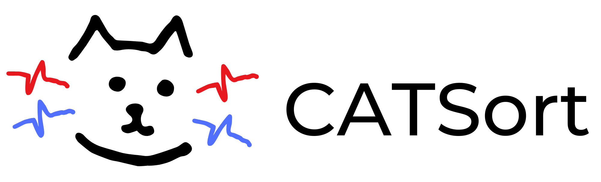

# CATSort

<p align="center">
  
</p>

**CATSort** (Collision-Aware with Template matching Sort) is a robust spike sorter designed to handle overlapping spikes (collisions) with high precision using a specific collision-handling stage before clustering followed by template matching.

## Key Features

- **Collision Handling**: Automatically identifies and flags collided spikes using multi-criterion feature analysis (amplitude, width, energy).
- **Template Matching**: Robust spike extraction using template-based matching (including 'wobble' for now).
- **Flexible Schemes**: Choose between an `adaptive` threshold optimization or an `original` fixed MAD (Median Absolute Deviation) multiplier scheme.
- **SpikeInterface Integration**: Fully compatible with the [SpikeInterface](https://github.com/SpikeInterface/spikeinterface) ecosystem.

## Installation

You can install `catsort` via pip:

```bash
pip install catsort
```

Or from source:

```bash
git clone https://github.com/lucasbeziers/CATSort.git
cd CATSort
pip install -e .
```

## Quick Start

```python
import spikeinterface.extractors as se
from catsort import run_catsort

# Load your recording
recording = se.read_binary("path_to_data.dat", sampling_frequency=30000, num_channels=384, dtype="int16")

# Run CATSort
sorting = run_catsort(recording)

# The result is a SpikeInterface Sorting object
print(sorting)
```

## Parameters

CATSort offers several parameters to fine-tune its behavior:

- `scheme`: `'original'` or `'adaptive'`. 
  - `'adaptive'` uses temporal collisions to optimize thresholds.
  - `'original'` uses fixed MAD multipliers.
- `mad_multiplier_amplitude`, `mad_multiplier_width`, `mad_multiplier_energy`: (Default: `7.0`, `10.0`, `15.0`) Used when `scheme='original'`.
- `detect_threshold`: Spike detection threshold in standard deviations (Default: `5`).

## License

MIT License. See [LICENSE](LICENSE) for details.
